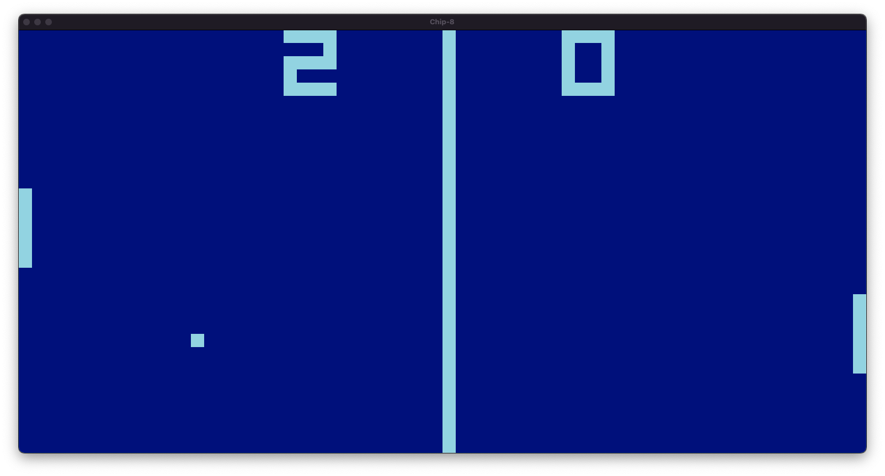
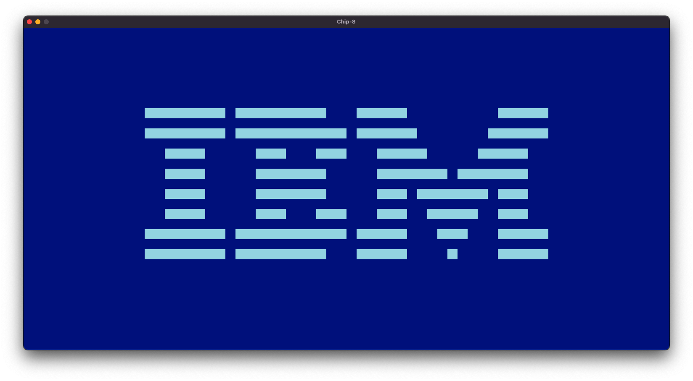

# CHIP-8

A CHIP-8 interpreter written in Go.
> CHIP-8 is an interpreted programming language, developed by Joseph Weisbecker on his 1802 microprocessor. It was initially used on the COSMAC VIP and Telmac 1800, which were 8-bit microcomputers made in the mid-1970s. 

## Usage

```
chip8 roms/pong.ch8
```

## Screenshots

### Pong


### IBM Logo


## Resources
Resources used to create this project:

- [Cowgod's Chip-8 Technical Reference](http://devernay.free.fr/hacks/chip8/C8TECH10.HTM#1.0)
- [CHIP-8 Page on Wikipedia](https://en.wikipedia.org/wiki/CHIP-8)